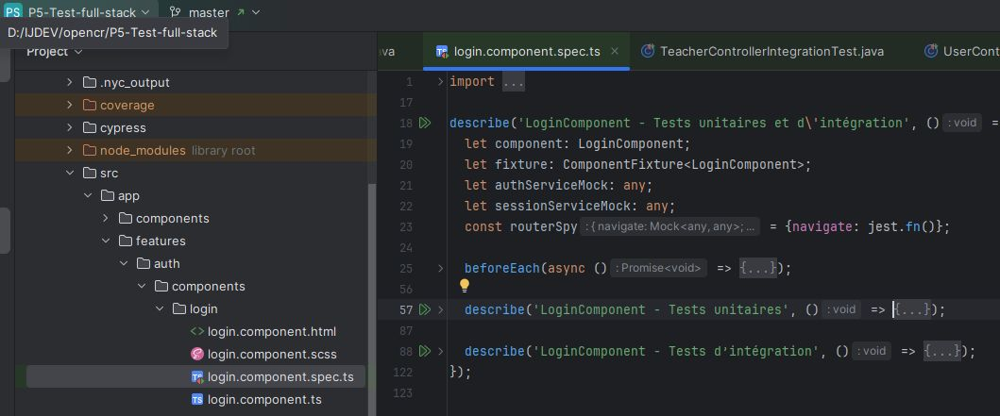
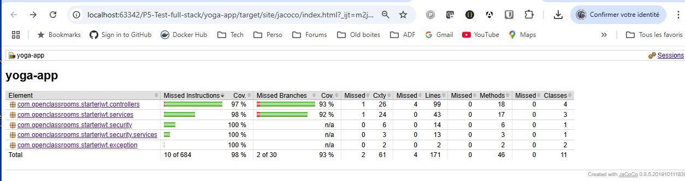

# Projet P5 - Test Full Stack (Front et Back)

Ce projet est une application web full stack comprenant deux sous-projets : un frontend développé avec Angular et un 
backend développé avec Spring Boot. 
Ce document vous guidera dans l'installation, l'exécution, les tests unitaires et d'intégration pour le front et 
le back, et la génération des rapports de couverture pour ce projet.

## Auteur et contexte
- Auteur : Christophe Pierrès
- Dans le cadre du projet N°5 d'OpenClassrooms, en vue d'obtenir la certification
  **Expert en développement logiciel**. Plus d'informations disponibles [ici](https://www.francecompetences.fr/recherche/rncp/36912/)

## Table des matières
1. [Prérequis](#prérequis)
2. [Installation de la base de données](#installation-de-la-base-de-données)
3. [Installation de l'application](#installation-de-lapplication)
   1. [Backend (Spring Boot)](#backend-spring-boot)
   2. [Frontend (Angular)](#frontend-angular)
4. [Exécution de l'application](#exécution-de-lapplication)
   1. [Backend](#backend)
   2. [Frontend](#frontend)
5. [Exécution des tests](#exécution-des-tests)
   - [Tests Frontend](#tests-frontend)
      1. [Tests unitaires Jest](#a-tests-unitaires-jest)
      2. [Tests E2E avec mocks (Cypress)](#b-tests-e2e-avec-mocks-cypress)
   - [Tests Backend](#tests-backend)
6. [Rapports de couverture](#rapports-de-couverture)

---

## Prérequis

Avant de commencer, assurez-vous d'avoir installé les outils suivants :

- [Docker](https://www.docker.com/) et Docker Compose
- [Node.js](https://nodejs.org/) (version 16 recommandée)
- [npm](https://www.npmjs.com/) (installé avec Node.js)
- [Java SDK](https://www.oracle.com/java/technologies/javase-downloads.html) (version 11 minimum)
- [Maven](https://maven.apache.org/)
- Un navigateur moderne supportant le mode interactif de Cypress (ex : Chrome)

---

## Installation de la base de données

1. **Démarrer le conteneur Docker MySQL**  
   À partir de la racine du projet, lancez la commande suivante pour démarrer la base de données MySQL avec Docker Compose :

   ```bash
   docker-compose --project-name cpierres_p5_back_test -f back/mysql8_docker_setup.yml up -d
   ```

2. **Informations importantes :**  
   - Cette base de dev écoute sur le port standard 3306
   - Le script SQL, de génération du schéma et d'importation des données de base, sera exécuté automatiquement.
   - Nom du conteneur : `mysql8-data-ocr-P5`
   - Un volume nommé `mysql8-data-ocr-P5` est automatiquement configuré pour persister les données sur votre machine.

   Pour vérifier que le conteneur fonctionne correctement, exécutez la commande suivante :

   ```bash
   docker ps
   ```

---

## Installation de l'application

### Backend (Spring Boot)
1. Accédez au répertoire du backend :
   ```bash
   cd back
   ```
2. Compilez et empaquetez l'application :
   ```bash
   mvn clean install
   ```

### Frontend (Angular)
1. Accédez au répertoire du frontend :
   ```bash
   cd front
   ```
2. Installez les dépendances Node.js nécessaires :
   ```bash
   npm install
   ```

---

## Exécution de l'application

### Backend
Pour démarrer l'API backend :
1. Assurez-vous que Docker (MySQL) est opérationnel.
2. Exécutez la commande suivante dans le répertoire `back` :
   ```bash
   mvn spring-boot:run
   ```

### Frontend
Pour démarrer le frontend :
1. Accédez au répertoire `front`.
2. Démarrez l'application :
   ```bash
   npm run start
   ```
3. L'application sera accessible par défaut à l'adresse : [http://localhost:4200](http://localhost:4200)

---

## Exécution des tests

### Tests Frontend

#### a) Tests unitaires Jest

1. Positionnez-vous dans le répertoire `front` :
   ```bash
   cd front
   ```
2. Lancez les tests unitaires et générez un rapport de couverture :
   ```bash
   npm run test:coverage
   ```
3. Consultez le rapport HTML généré ici :
   ```
   front/coverage/jest/lcov-report/index.html
   ```
   


   Si vous regardez le code des tests jest, vous observerez que ceux-ci
   sont généralement scindés en deux groupes. Par exemple :
   

Vous pouvez noter que curieusement les rapports de couverture lancés par ces 2 commandes différentes ne génèrent pas 
tout à fait les même résultats ! Ils sont néanmoins très proches.

---

#### b) Tests E2E avec mocks (Cypress)

1. Lancez les tests de manière automatisée :
   ```bash
   npm run e2e:ci
   ```
2. Consultez la sortie console (rapport détaillé) :
<details style="font-size: 12px; font-family: 'Courier New', monospace; background-color: #f8f8f8;">
<summary>Déplier pour voir le rapport console</summary>
<pre style="font-size: 8px; font-family: 'Courier New', monospace; background-color: #f8f8f8; ">
  (Run Starting)

┌────────────────────────────────────────────────────────────────────────────────────────────────┐
│ Cypress:        10.4.0                                                                         │
│ Browser:        Chrome 133 (headless)                                                          │
│ Node Version:   v16.20.2 (C:\Program Files\nodejs\node.exe)                                    │
│ Specs:          3 found (001register.cy.ts, 002login.cy.ts, 003session-yoga.cy.ts)             │
│ Searched:       cypress/e2e/**/*.cy.{js,jsx,ts,tsx}                                            │
└────────────────────────────────────────────────────────────────────────────────────────────────┘


────────────────────────────────────────────────────────────────────────────────────────────────────

Running:  001register.cy.ts                                                               (1 of 3)


Register spec
√ Register new User passes (2027ms)
√ Tentative Register User existant affiche erreur (1184ms)
√ correction email précédent en doublon par user2@test.com et enregistrement ok (474ms)


3 passing (4s)


(Results)

┌────────────────────────────────────────────────────────────────────────────────────────────────┐
│ Tests:        3                                                                                │
│ Passing:      3                                                                                │
│ Failing:      0                                                                                │
│ Pending:      0                                                                                │
│ Skipped:      0                                                                                │
│ Screenshots:  0                                                                                │
│ Video:        false                                                                            │
│ Duration:     4 seconds                                                                        │
│ Spec Ran:     001register.cy.ts                                                                │
└────────────────────────────────────────────────────────────────────────────────────────────────┘

────────────────────────────────────────────────────────────────────────────────────────────────────

Running:  002login.cy.ts                                                                  (2 of 3)


Login spec
√ Login as Admin successful (879ms)
√ Affichage du compte (me), contrôle données affichées et absence de Delete (117ms)
√ Login as Customer user@test.com successful (675ms)
√ Login user2@test.com, affichage de Account (me), Suppression du compte (843ms)
√ Login non autorisé (733ms)


5 passing (4s)


(Results)

┌────────────────────────────────────────────────────────────────────────────────────────────────┐
│ Tests:        5                                                                                │
│ Passing:      5                                                                                │
│ Failing:      0                                                                                │
│ Pending:      0                                                                                │
│ Skipped:      0                                                                                │
│ Screenshots:  0                                                                                │
│ Video:        false                                                                            │
│ Duration:     3 seconds                                                                        │
│ Spec Ran:     002login.cy.ts                                                                   │
└────────────────────────────────────────────────────────────────────────────────────────────────┘


────────────────────────────────────────────────────────────────────────────────────────────────────

Running:  003session-yoga.cy.ts                                                           (3 of 3)


Gestion des sessions de yoga - E2E
Actions d'initialisation pour l'administrateur
√ Créer 3 sessions de yoga (9004ms)
√ Vérifier que les 3 sessions sont affichées et avec le bon contenu (772ms)
√ Met à jour la deuxième session en changeant de professeur (1051ms)
√ Supprimer la 3ème session (1874ms)
√ Vérifier que 2 sessions restantes sont affichées et avec le bon contenu (726ms)
√ Tenter de saisir une Session avec une description de plus de 2000 car (3016ms)
√ Logout (764ms)
Actions pour le profil non-administrateur
√ S'inscrire à la session 1 et vérifier les changements (876ms)
√ Se désinscrire de la session 1 et vérifier le compteur (826ms)


9 passing (20s)


(Results)

┌────────────────────────────────────────────────────────────────────────────────────────────────┐
│ Tests:        9                                                                                │
│ Passing:      9                                                                                │
│ Failing:      0                                                                                │
│ Pending:      0                                                                                │
│ Skipped:      0                                                                                │
│ Screenshots:  0                                                                                │
│ Video:        false                                                                            │
│ Duration:     19 seconds                                                                       │
│ Spec Ran:     003session-yoga.cy.ts                                                            │
└────────────────────────────────────────────────────────────────────────────────────────────────┘


====================================================================================================

(Run Finished)


       Spec                                              Tests  Passing  Failing  Pending  Skipped
┌────────────────────────────────────────────────────────────────────────────────────────────────┐
│ √  001register.cy.ts                        00:04        3        3        -        -        - │
├────────────────────────────────────────────────────────────────────────────────────────────────┤
│ √  002login.cy.ts                           00:03        5        5        -        -        - │
├────────────────────────────────────────────────────────────────────────────────────────────────┤
│ √  003session-yoga.cy.ts                    00:19        9        9        -        -        - │
└────────────────────────────────────────────────────────────────────────────────────────────────┘
√  All specs passed!                        00:27       17       17        -        -        -
</pre>
</details>

3. Ouvrez le rapport HTML de couverture :
   ```
   front/coverage/lcov-report/index.html
   ```
   

4. Pour générer un rapport plus détaillé avec `nyc` :
   ```bash
   npm run e2e:coverage
   ```
   Résumé du rapport NYC :  
     
   Détail du rapport NYC :  
   

---

#### c) Tests E2E en mode interactif (mocks)
1. Assurez-vous que le frontend est démarré (`npm run start`).
2. Lancez Cypress en mode interactif :
   ```bash
   npm run cypress:open
   ```

   **Copies d'écran :**
   - Liste des specs : 
   - Tests des fonctionnalités de Register : 
   - Tests des fonctionnalités de Login : 
   - Gestion des fonctionnalités pour les Sessions de yoga : 

---

#### d) Tests E2E avec backend réel

1. Assurez-vous que Docker (MySQL) et le backend Spring Boot fonctionnent.
2. Positionnez-vous dans `front` :
   ```bash
   cd front
   ```
3. Lancez les tests E2E avec le backend en mode automatisé :
   ```bash
   npm run cypress:run-real-backend
   ```
4. Ou en mode interactif :
   ```bash
   npm run cypress:open-real-backend
   ```

⚠️ Si nécessaire, réinitialisez la base de données avec le script SQL avant de relancer les tests :

Se positionner sur la racine du projet puis en cas d'exécution sous cmd Windows ou autres OS :   
```bash
docker exec -i mysql8-data-ocr-P5 mysql -uroot -popencr_pw_root < ressources/sql/script.sql
```
Si exécution sous powershell plus ancien que la version 7 :
```powershell
cmd /c "docker exec -i mysql8-data-ocr-P5 mysql -uroot -popencr_pw_root < ressources/sql/script.sql"
```
Si exécution sous powershell version 7 ou + :
```powershell
Get-Content -Encoding UTF8 ressources/sql/script.sql | docker exec -i mysql8-data-ocr-P5 mysql -uroot -popencr_pw_root
```
A noter que j'avais eu un souci avec les accentués lorsque ma première commande docker était lancée depuis Powershell 5 
(malgré le fait que le script sql est bien en UTF8).
---

### Tests Backend

1. Positionnez-vous dans `back` :
   ```bash
   cd back
   ```
2. Démarrez les tests unitaires avec Maven (tests rapides basés sur des mocks) :
   ```bash
   mvn clean test
   ```
3. ou bien, démarrez <u>en plus</u> les tests d'intégration systèmes avec Maven (tests suffixés par IT) :
   ```bash
   mvn clean validate
   ```
4. Consultez le rapport de couverture généré par JaCoCo :
   ```
   target/site/jacoco/index.html
   ```

   - Rapport global (DTO exclus) : 
   

Les tests backend sont basés sur des mocks pour simuler les appels aux services et aux bases de données
d'une manière rapide.
Sur les controllers, des tests d'intégration systèmes ont été réalisés (que j'aurais pu suffixer par SIT
plutôt que IT) afin de mieux tester les interactions complètes avec les services et la sécurité.
Afin d'éviter toute interférence avec la base de données de dev, j'ai défini spécifiquement pour les tests une base 
mémoire H2 avec dialecte mysql. Si l'application avait été plus complexe, j'aurais opté pour un TestContainer mysql
mais dans le cas présent, la base H2 fonctionne bien et est plus rapide.

Comme j'ai fait en sorte qu'**optionnellement mes tests e2e puissent travailler avec la base de données réelle** 
(avec données de test), ceci permet de valider totalement les interactions systèmes.

Les objets les plus sensibles (services et controllers) sont parfaitement couverts, et les tests e2e, lorsque
lancés sur le "vrai backend", permettent de couvrir toute la chaine.

---

## Rapports de couverture de tests

- **Frontend Jest** : Disponible ici : `front/coverage/jest/lcov-report/index.html`
- **Frontend Cypress** : Disponible ici : `front/coverage/lcov-report/index.html`
- **Backend JaCoCo** : Disponible ici : `back/target/site/jacoco/index.html`

---

